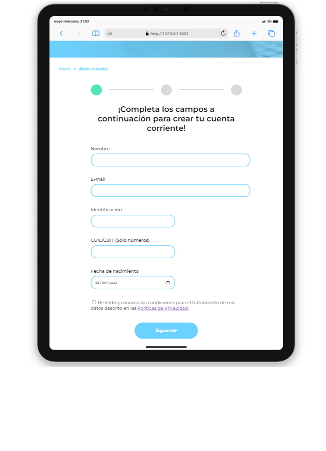
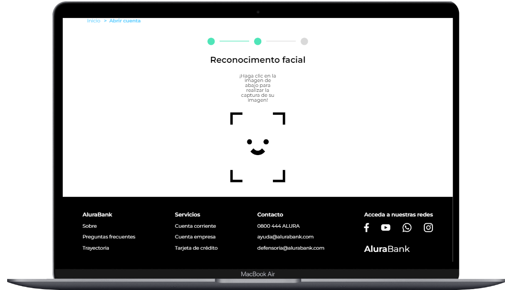

  

  

Formulario de creación de cuenta para el banco virtual AluraBank.

## Bienvenido al repositorio del Alura Bank 
* Validamos digitos de control
* Validaciones comparando fechas
* Personalizacion de mensajes de error
* Integración de la camara web del usuario en la pantalla del navegador
* Capturar fotografías a través de la camara web
* Guardar y editar datos guardados en el navegador(localStorage)

## Tecnologías utilizadas durante el curso
* JavaScript

## Tecnologías utilizadas en el proyecto
* HTML
* CSS

## Capturas de pantalla

